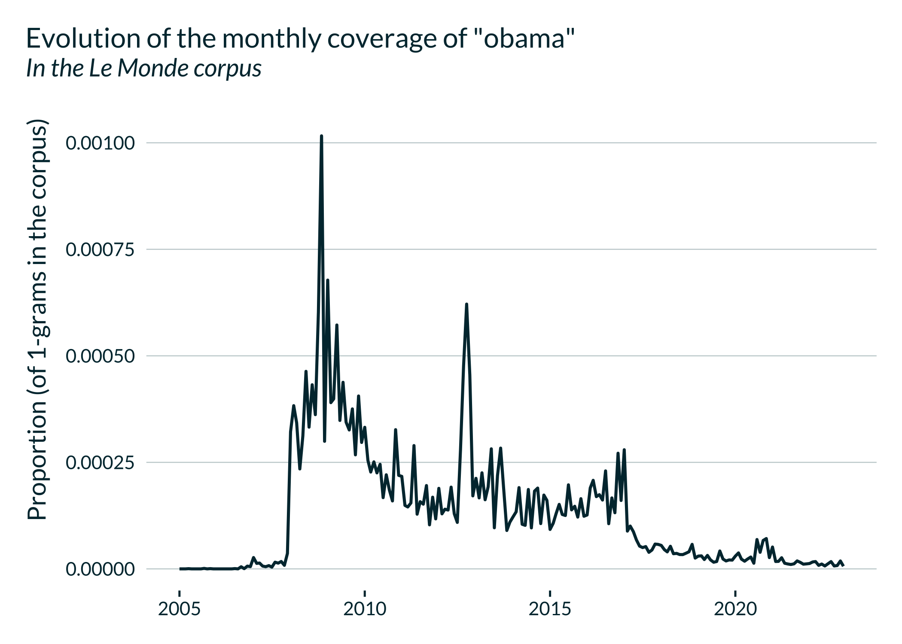

<!-- README.md is generated from README.Rmd. Please edit that file -->

# rallicagram

<!-- badges: start -->
<!-- badges: end -->

## Overview

`rallicagram` calls the [Gallicagram API](https://regicid.github.io/api)
directly from R.
[Gallicagram](https://shiny.ens-paris-saclay.fr/app/gallicagram)
historically enabled to build time series of keywords used in a set of
French corpora:

- **Historical newspapers** from [Gallica](https://gallica.bnf.fr/), the
  digital library of the French National Library (Bibliothèque nationale
  de France, BnF) (corpus=“press”). A corpus of 3 million issues,
  reliable from 1789 to 1950. Yearly or monthly resolution.
- **Public domain books** available on
  [Gallica](https://gallica.bnf.fr/) (corpus=“books”). 300 000 books.
  Increased reliability through the 16th to 18th centuries and up
  to 1940. Yearly resolution.
- **Articles published in [*Le Monde*](https://www.lemonde.fr/)**
  (corpus=“lemonde”). Available and reliable from December 1944 to
  February 22, 2022. Yearly, monthly or daily resolution.

Additional information can be found on a
[preprint](https://osf.io/preprints/socarxiv/84bf3/) by Gallicagram
developers [Benoît de Courson](https://regicid.github.io/) and [Benjamin
Azoulay](https://benjamin-azoulay.my.canva.site/) and on the “Notice”
tab of the [Gallicagram
website](https://shiny.ens-paris-saclay.fr/app/gallicagram).

The set of corpora has now been vastly extended:

| Corpus             | Corpus Name                    | Reliable From | Reliable To | Nb Words | Max Length | Resolution |
|:-------------------|:-------------------------------|--------------:|------------:|---------:|-----------:|:-----------|
| lemonde            | Le Monde                       |          1944 |        2023 | 1.50e+09 |          4 | daily      |
| presse             | Presse de Gallica              |          1789 |        1950 | 5.70e+10 |          3 | monthly    |
| livres             | Livres de Gallica              |          1600 |        1940 | 1.60e+10 |          5 | yearly     |
| ddb                | Deutsches Zeitungsportal (DDB) |          1780 |        1950 | 3.90e+10 |          2 | monthly    |
| american_stories   | American Stories               |          1798 |        1963 | 2.00e+10 |          3 | yearly     |
| paris              | Journal de Paris               |          1777 |        1827 | 8.60e+07 |          2 | daily      |
| moniteur           | Moniteur Universel             |          1789 |        1869 | 5.11e+08 |          2 | daily      |
| journal_des_debats | Journal des Débats             |          1789 |        1944 | 1.20e+09 |          1 | daily      |
| la_presse          | La Presse                      |          1836 |        1869 | 2.53e+08 |          2 | daily      |
| constitutionnel    | Le Constitutionnel             |          1821 |        1913 | 6.40e+07 |          2 | daily      |
| figaro             | Le Figaro                      |          1854 |        1952 | 8.70e+08 |          2 | daily      |
| temps              | Le Temps                       |          1861 |        1942 | 1.00e+09 |          2 | daily      |
| petit_journal      | Le Petit Journal               |          1863 |        1942 | 7.45e+08 |          2 | daily      |
| petit_parisien     | Le Petit Parisien              |          1876 |        1944 | 6.31e+08 |          2 | daily      |
| huma               | L’Humanité                     |          1904 |        1952 | 3.18e+08 |          2 | daily      |
| substitles         | Opensubtitles (français)       |          1935 |        2020 | 1.70e+07 |          3 | yearly     |
| subtitles_en       | Opensubtitles (anglais)        |          1930 |        2020 | 1.02e+08 |          3 | yearly     |

## Installation

You can install the development version of rallicagram from
[GitHub](https://github.com/vincentbagilet/rallicagram) with:

``` r
# install.packages("devtools")
devtools::install_github("vincentbagilet/rallicagram")
```

## Usage

The main function, `gallicagram`, builds a data frame with the yearly,
monthly or daily proportion of mentions of a term in one of the three
corpora between two specified dates.

``` r
library(rallicagram)

gallicagram(
  keyword = "président", 
  corpus = "lemonde", 
  from = 1960, 
  to = 1970,
  resolution = "monthly"
)
#> # A tibble: 132 × 10
#>    date       keyword   n_occur n_total prop_occur  year month corpus resolution
#>    <date>     <chr>       <int>   <int>      <dbl> <int> <int> <chr>  <chr>     
#>  1 1960-01-01 président    1338  872943    0.00153  1960     1 lemon… monthly   
#>  2 1960-02-01 président    1360  915672    0.00149  1960     2 lemon… monthly   
#>  3 1960-03-01 président    1461  928764    0.00157  1960     3 lemon… monthly   
#>  4 1960-04-01 président    1239  772707    0.00160  1960     4 lemon… monthly   
#>  5 1960-05-01 président    1355  835612    0.00162  1960     5 lemon… monthly   
#>  6 1960-06-01 président    1314  850245    0.00155  1960     6 lemon… monthly   
#>  7 1960-07-01 président    1189  942062    0.00126  1960     7 lemon… monthly   
#>  8 1960-08-01 président     979  739018    0.00132  1960     8 lemon… monthly   
#>  9 1960-09-01 président    1506  904804    0.00166  1960     9 lemon… monthly   
#> 10 1960-10-01 président    1107  826661    0.00134  1960    10 lemon… monthly   
#> # ℹ 122 more rows
#> # ℹ 1 more variable: n_of <chr>
```

It enables to draw nice graphs representing the evolution of the use of
a term in time.



Additional functions, to describe close co-occurrences or words
associated with a ngram are also available in this package and described
in the [vignette](articles/rallicagram.html).
